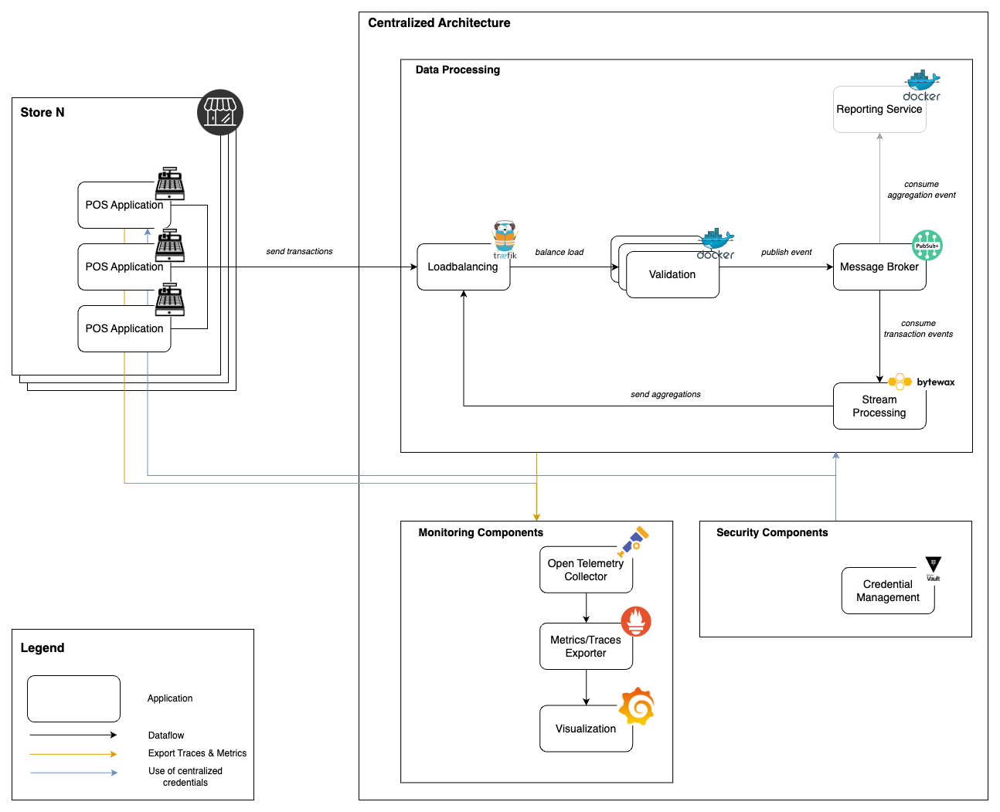
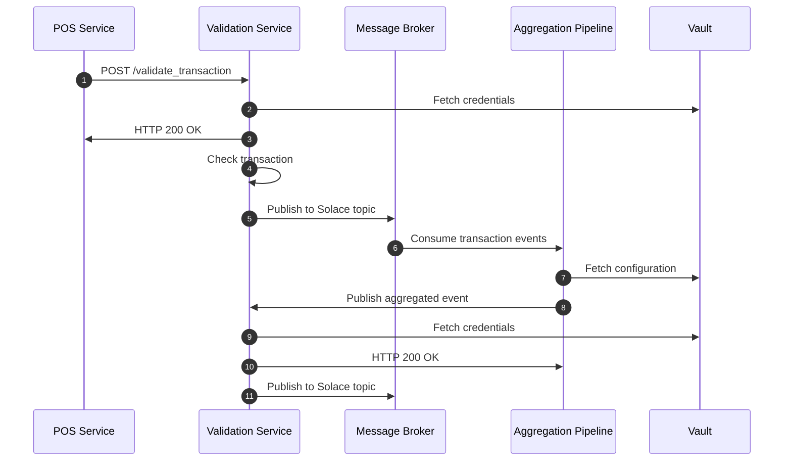
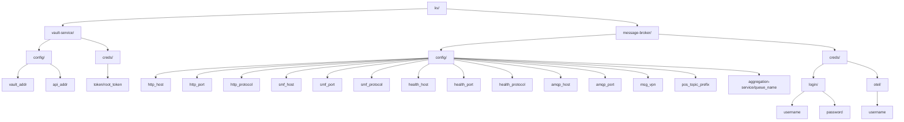
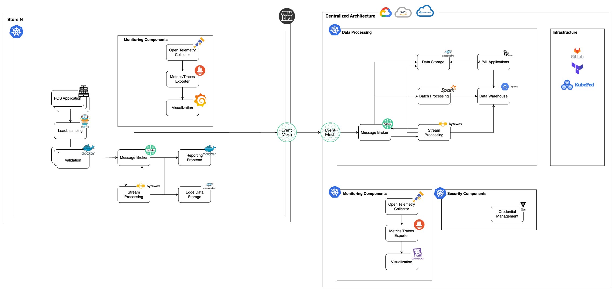

# DLMDWWDE - Data Engineering Project: POS Real-Time Integration

**University Project for Data Engineering**  
This project implements a real-time, data-intensive backend for Point-of-Sale (POS) transactions using a Microservice Architecture. The system is built to be reliable, scalable, maintainable, and secure while addressing data protection and governance. The project showcases modern data engineering principles, integrating message brokering, monitoring, secrets management, and real-time data processing.

---

## Table of Contents

- [DLMDWWDE - Data Engineering Project: POS Real-Time Integration](#dlmdwwde---data-engineering-project-pos-real-time-integration)
  - [Table of Contents](#table-of-contents)
  - [Overview](#overview)
  - [Project Goals](#project-goals)
  - [System Architecture](#system-architecture)
    - [High-Level Architecture](#high-level-architecture)
    - [Sequence Diagram](#sequence-diagram)
    - [Vault Structure](#vault-structure)
  - [Key Features and Service Overview and Functional Description](#key-features-and-service-overview-and-functional-description)
    - [1. Message Broker Service (Solace PubSub+)](#1-message-broker-service-solace-pubsub)
    - [2. Validation Service](#2-validation-service)
    - [3. Point-of-Sale (POS) Service](#3-point-of-sale-pos-service)
    - [4. Aggregation Pipeline Service](#4-aggregation-pipeline-service)
    - [5. Traefik Load Balancer](#5-traefik-load-balancer)
    - [6. Vault Service](#6-vault-service)
    - [7. Monitoring Services (Prometheus, Grafana, Tempo, OpenTelemetry Collector)](#7-monitoring-services-prometheus-grafana-tempo-opentelemetry-collector)
    - [8. Solace Prometheus Exporter](#8-solace-prometheus-exporter)
    - [9. Infrastructure Management with Terraform](#9-infrastructure-management-with-terraform)
  - [Monitoring and Observability](#monitoring-and-observability)
    - [1. OpenTelemetry for Distributed Tracing](#1-opentelemetry-for-distributed-tracing)
    - [2. Prometheus for Metrics Collection](#2-prometheus-for-metrics-collection)
    - [3. Grafana for Visualization](#3-grafana-for-visualization)
    - [4. Health Checks for Services](#4-health-checks-for-services)
  - [Ensuring **Data Governance**, **Data Isolation**, and **Security** in the Project](#ensuring-data-governance-data-isolation-and-security-in-the-project)
    - [1. Data Governance](#1-data-governance)
    - [2. Data Isolation](#2-data-isolation)
    - [3. Data Security](#3-data-security)
    - [Summary of Key Measures](#summary-of-key-measures)
  - [Setup Instructions](#setup-instructions)
    - [Prerequisites](#prerequisites)
    - [Steps to Run](#steps-to-run)
  - [Challenges and Lessons Learned](#challenges-and-lessons-learned)
    - [Challenges](#challenges)
    - [Lessons Learned](#lessons-learned)
    - [Steps Required for a Production-Ready Setup \& Future Enhancements](#steps-required-for-a-production-ready-setup--future-enhancements)
  - [Future Architectural View](#future-architectural-view)
      - [1. Store-Level Architecture (Edge Components)](#1-store-level-architecture-edge-components)
    - [Why Edge Processing in the Store?](#why-edge-processing-in-the-store)
      - [2. Centralized Architecture (Cloud/Datacenter)](#2-centralized-architecture-clouddatacenter)
      - [3. Monitoring and Observability](#3-monitoring-and-observability)
      - [4. Security Components](#4-security-components)
      - [5. Infrastructure Management](#5-infrastructure-management)
  - [Contact](#contact)

---

## Overview

This project demonstrates a real-time integration platform for POS data, designed to simulate a production-grade data engineering workflow. It supports:

- Real-time POS transaction streaming
- Transaction validation
- Data aggregation for analytics
- Monitoring, tracing, and logging
- Secure secrets management via Vault

The infrastructure is fully containerized with **Docker Compose**, enabling rapid local deployment and reproducibility.

---

## Project Goals

- **Reliability**: Ensure fault-tolerant communication between services.
- **Scalability**: Design the system to handle increasing transaction volumes.
- **Maintainability**: Use modular and reusable Microservice Architecture.
- **Real-Time**: Use modern tools and architecture to define a real-time backend for pos transactions.
- **Data Security**: Safeguard sensitive information using Vault.
- **Data Governance**: Ensure compliance with data handling and storage regulations.
- **Observability**: Provide detailed insights into system health and performance.

---

## System Architecture

### High-Level Architecture



---

### Sequence Diagram

The following sequence diagram illustrates the fundamental communication between the services. Monitoring and load balancing components are intentionally excluded to emphasize the raw message exchange.

There are two distinct communication flows in this process:
1. In the first flow, the POS Service acts as the publisher, while the Aggregation Service subscribes to transaction events.
2. In the second flow, the Aggregation Service becomes the publisher, with the Reporting Service (out of scope for this diagram) acting as the subscriber.

This interaction encompasses two key events within the message exchange.



---

### Vault Structure

The system uses Vault to manage configurations and secrets.
This directory structure is designed to enhance data governance, security, and isolation by organizing sensitive configurations and credentials in a clear and logical way. It enables:
- **Data Security**: Sensitive information (e.g., credentials) is isolated in dedicated directories, reducing the risk of unauthorized access or accidental exposure.
- **Access Control**: Segregating service configurations supports fine-grained permissions, ensuring only authorized systems or users can access specific data.



---

## Key Features and Service Overview and Functional Description

### 1. Message Broker Service (Solace PubSub+)
- **Functionality:**  
  The Message Broker acts as the central communication hub within the architecture. It facilitates real-time message exchange between services based on a publisher-subscriber model.  
- **Role in the Architecture:**  
  - **Data Isolation:** Ensures messages are directed only to the relevant services through the use of queues and topics.  
  - **Reliability:** Provides guaranteed message delivery for critical processes like aggregation and validation.  
  - **Scalability:** Handles high message throughput via asynchronous processing and dedicated message spooling.
  - **Real-time:** Enables low-latency message exchange, ensuring that events such as POS transactions are immediately available for downstream processing, aggregation, and analytics. This capability is essential for applications like real-time dashboards, fraud detection, and responsive customer-facing systems.
  - **Observability:** Monitored using Prometheus and OpenTelemetry to analyze performance and detect errors.

### 2. Validation Service
- **Functionality:**  
  The Validation Service verifies and validates incoming POS transactions for consistency and correctness, such as ensuring item prices sum up to the correct total. Aswell the validation service verifies the aggregated events.  
- **Role in the Architecture:**  
  - **Data Quality:** Acts as a custom schema registry by ensuring only valid messages are processed further.  
  - **Data Security:** Reduces the risk of processing incorrect or manipulated data.  
  - **Integration:** Publishes validated messages to designated queues in the Message Broker.
  - **Observability:** Monitored using Prometheus and OpenTelemetry to analyze performance and detect errors.

### 3. Point-of-Sale (POS) Service
- **Functionality:**  
  Simulates real-time POS transactions by generating POS data and sending it to the Validation Service.  
- **Role in the Architecture:**  
  - **Data Source:** Produces synthetic data to support use cases like real-time analytics.  
  - **Testability:** Allows validation of the entire pipeline through controlled data input.  
  - **Observability:** Monitored using Prometheus and OpenTelemetry to analyze performance and detect errors.

### 4. Aggregation Pipeline Service
- **Functionality:**  
  Aggregates validated POS transactions to calculate turnover by store in a 10 seconds time window.
- **Role in the Architecture:**  
  - **Data Processing:** Executes streaming jobs to transform and aggregate data in real-time.  
  - **Data Governance:** Ensures consistent and traceable data processing using dedicated queues for each store.  
  - **Business Insights:** Delivers aggregated results to for the reporting service which were out of scope in project.
  - **Observability:** Monitored using Prometheus and OpenTelemetry to analyze performance and detect errors.

### 5. Traefik Load Balancer
- **Functionality:**  
  Distributes incoming HTTP traffic across the microservices and provides load balancing.  
- **Role in the Architecture:**  
  - **Scalability:** Ensures requests are evenly distributed across multiple service instances.  
  - **Routing:** Routes traffic based on URI paths (e.g., `/validation-service`) to the appropriate services.

### 6. Vault Service
- **Functionality:**  
  Serves as a central secret management system for sensitive data like passwords and configuration values.  
- **Role in the Architecture:**  
  - **Data Security:** Safely stores passwords and tokens and enforces role-based access control.  
  - **Data Isolation:** Mounts secrets at runtime only into the respective containers.  
  - **Automation:** Uses Vault Agents and AppRoles to dynamically provision secrets for each service.

### 7. Monitoring Services (Prometheus, Grafana, Tempo, OpenTelemetry Collector)
- **Functionality:**  
  - **Prometheus:** Collects metrics such as HTTP request counts, error rates, and latencies from services.  
  - **Grafana:** Visualizes collected metrics and traces.  
  - **Tempo:** In combination with Grafana it enables distributed tracing to analyze end-to-end processes across the system.  
  - **OpenTelemetry Collector:** Sends traces and metrics to Prometheus or Tempo for analysis.  
- **Role in the Architecture:**  
  - **Observability:** Provides deep insights into the performance and behavior of services.  
  - **Error Analysis:** Identifies bottlenecks or root causes of failures through tracing and metrics.  
  - **Governance:** Documents system health for long-term maintainability.

### 8. Solace Prometheus Exporter
- **Functionality:**  
  Exports metrics from the Message Broker into a Prometheus-compatible format.  
- **Role in the Architecture:**  
  - **Monitoring:** Captures broker-specific metrics like queue depth and message rates.  
  - **Optimization:** Assists in capacity management and performance tuning for the broker.

### 9. Infrastructure Management with Terraform
- **Functionality:**  
  Terraform is used to automate the provisioning and configuration of the Message Broker (Solace PubSub+) and its associated resources, such as queues, topics, and access controls. It ensures that the infrastructure is defined as code, making it reproducible and manageable.

- **Role in the Architecture:**  
  - **Automation:** Streamlines the setup process of the Message Broker by programmatically defining configurations, reducing manual effort and the risk of errors.
  - **Reproducibility:** Guarantees that the same infrastructure can be recreated in different environments (e.g., local development, testing, or production) with consistent results.
  - **Data Governance:** Configures access policies, ensuring only authorized services and users can interact with specific queues and topics.
  - **Scalability:** Allows dynamic adjustments to the infrastructure, such as scaling the number of queues or updating configurations, by modifying the Terraform scripts.
  - **Seamless Integration:** Ensures that the Message Broker is pre-configured with required resources, such as POS transaction queues, validation topics, and monitoring metrics, so that the services can interact with it immediately upon deployment.

---

Through this structured service architecture, the project ensures efficiency, scalability, maintainability, and robust security while adhering to high standards for data governance and observability.

---

## Monitoring and Observability

Monitoring and observability in this project are implemented through a combination of **OpenTelemetry**, **Prometheus**, and **Grafana**. These tools work together to ensure real-time insights into system behavior, performance, and reliability.

---

### 1. OpenTelemetry for Distributed Tracing  
- **Integration**:  
   OpenTelemetry is used to instrument services (e.g., `validation-service`, `pos-service`) for distributed tracing. Spans are created to trace request flows, execution times, and service interactions.
   Solace PubSub+ Message Broker is automatically instrumented with the configuration of a telemetry profile. 
- **Trace Export**:  
   Traces are exported to **Grafana Tempo** through the OpenTelemetry Collector, enabling seamless visualization of end-to-end request lifecycles.  
- **Instrumentation**:  
   Automatic instrumentation is enabled for FastAPI and HTTP requests using OpenTelemetry’s FastAPI and Requests libraries.  

---

### 2. Prometheus for Metrics Collection  
- **Instrumentation**:  
   Metrics such as HTTP request counts, request durations, and error rates are instrumented using the `prometheus-fastapi-instrumentator`.  
- **Metrics Export**:  
   Prometheus scrapes metrics exposed by most of the services at the `/metrics` after initializing `prometheus_client`. Key metrics include:  
   - **Total requests**: `http_requests_total`  
   - **Request duration histograms**: `http_request_duration_seconds`  
   - **Error rates and response sizes**: `http_response_size_bytes`  
- **Solace Monitoring**:  
   Solace PubSub+ metrics are collected using the **Solace Prometheus Exporter**, providing insights into:  
   - Queue performance  
   - Message rates  
   - Broker health and resource utilization  

---

### 3. Grafana for Visualization
- **Metrics**:  
   Grafana visualizes data from Prometheus. Visualization include:  
   - **HTTP Metrics**: Request rates, error percentages, and latency histograms  
   - **Response Metrics**: Request and response sizes over time  
   - **Solace Metrics**: Queue depth, throughput, and broker health  
- **Trace Visualization**:  
   Traces exported via OpenTelemetry are displayed in Grafana Tempo, providing detailed debugging and latency analysis across services.  

---

### 4. Health Checks for Services  
- **Health Endpoints**:  
   Services expose `/health` endpoints to report readiness and operational status.  
- **Health Scripts**:  
   Health check scripts ensure service availability at startup to ensure seamless integration into the architecture and to prevent errors.  

---

By combining **OpenTelemetry** for tracing, **Prometheus** for metrics collection, and **Grafana** for visualization, the system achieves **comprehensive monitoring and observability**. This ensures transparency, reliability, and quick detection of issues across the entire data infrastructure.

---

## Ensuring **Data Governance**, **Data Isolation**, and **Security** in the Project

This project adheres to strong principles of **Data Governance**, **Data Isolation**, and **Data Security** to ensure reliability, scalability, maintainability, and compliance. Below is an overview of the measures taken throughout the system design and implementation:

---

### 1. Data Governance

**Data Governance** ensures that the data processed, validated, and stored adheres to organizational standards, policies, and compliance requirements. In this project:

- **Validation Service as a Schema Registry**  
   The `Validation Service` acts as a self-built schema registry by validating incoming **Point of Sale (POS)** transaction data.  
   - Data schemas are defined using Pydantic models for strict validation.  
   - Validation ensures that only structurally sound and semantically correct data proceeds further into the system, reducing data inconsistencies and errors.  
   - Any malformed or unauthorized transactions are logged and rejected to maintain data quality.
   - Validation to ensure that the sum of all item prices matches the total transaction amount in the event and correct them if necessary.

- **Role-based Policies via HashiCorp Vault**  
   - HashiCorp Vault policies control access to secrets, configurations, and credentials across services.  
   - Each service has its dedicated credentials, with limited permissions for its role, ensuring the principle of **least privilege**.  
   - Secrets are dynamically generated and mounted/injected into the services at runtime, reducing exposure to plaintext credentials.

- **Observability and Monitoring**  
   - OpenTelemetry and Prometheus provide traceability and real-time visibility into data movement, validation failures, and system behavior.  
   - Grafana monitors metrics like request durations, validation errors, and queue backlogs, enabling enforcement of data governance policies.
   - Grafana provide a visible view onto the OpenTelemetry Traces
---

### 2. Data Isolation

Data Isolation is achieved through **service boundaries**, **dedicated queues**, and strict access controls:

- **Microservices Architecture**  
   Each service (POS, Validation, Aggregation, etc.) is isolated within its own container and operates independently. This ensures:  
   - Failure in one service does not propagate to others (high fault tolerance).  
   - Data processing remains isolated, with dedicated endpoints and responsibilities for each service.

- **Solace PubSub+ Queues for Data Separation**  
   Solace PubSub+ acts as a message broker to decouple producers (POS services) from consumers (Validation and Aggregation services).  
   - Queues ensure isolated message delivery to a specific subscriber.  
   - Each queue has **exclusive access** settings, preventing unauthorized services from consuming messages.  
   - Role-based ACLs (Access Control Lists) restrict publishing and subscribing permissions to ensure that only intended services can interact with specific topics or queues.

- **Environment-specific Configuration**  
   - **Environment variables** are mounted at runtime via **Vault agent templates**. Each service loads only its required configuration into its runtime environment.  
   - Sensitive secrets like credentials, tokens, and API endpoints are not hardcoded but are dynamically retrieved, ensuring no cross-service leakage.

- **Storage Isolation**   
   - Each service's configuration and logs are stored in its own volume to ensure isolation.  
   - This approach ensures that operational data remains independent across services.

---

### 3. Data Security

Data Security measures include encryption, access control, and secrets management:

- **HashiCorp Vault for Secret Management**  
   - Vault serves as the central point for storing and managing all service credentials and secrets.  
   - Access to secrets is tightly controlled via AppRole authentication and policies, ensuring that only authorized services can fetch their respective credentials.  
   - Secrets are fetched at runtime using `Vault Agent` and **templating** mechanisms.

- **Dynamic Credential Creation**  
   - Passwords for critical components are dynamically generated via secure random scripts.

- **Secured Communication**  
   - The application supports secure communication channels:  
     - Services expose only necessary ports for communication.  
     - Traefik acts as a load balancer to route traffic securely to the appropriate service.  
   - API endpoints are protected via Basic Authentication, ensuring they are not accessible publicly.

- **Service-level Access Control**  
   - Solace ACLs are defined for each service to restrict publish/subscribe permissions.  
   - Validation and Aggregation services have limited permissions:  
     - **Validation Service** can only publish to validated topics.  
     - **Aggregation Service** subscribes only to specific POS transaction queues.

- **Audit Logging**  
   - Logs are centrally stored in the `/app/logs` directory and can be further forwarded to observability tools _(future enhancement)_.  
   - Application errors and security failures (e.g., invalid requests, unauthorized access) are logged for audit purposes.

---

### Summary of Key Measures

| Measure                      | Technology/Approach                                | Purpose                                  |
|------------------------------|--------------------------------------------------|------------------------------------------|
| **Secrets Management**       | HashiCorp Vault                                  | Secure dynamic secret provisioning       |
| **Access Control**           | Solace ACLs, Vault Policies                      | Enforce least privilege principle        |
| **Data Validation**          | Validation Service (Schema Registry)             | Ensure data quality                      |
| **Data Isolation**           | Solace Queues, Microservices Architecture        | Service isolation and fault tolerance    |
| **Storage Management**       | Isolated Volumes                                 | Isolate data for durability and security |
| **Runtime Configurations**   | Vault Agent Templates, Environment Variables     | Prevent static configuration leaks       |
| **Monitoring & Traceability**| OpenTelemetry, Prometheus, Grafana Metrics/Traces| Enhance observability and troubleshooting|

---

## Setup Instructions

### Prerequisites

- Docker and Docker Compose installed
- Terraform and Vault CLI (optional for debugging)

### Steps to Run

1. Clone the repository:

   ```bash
   git clone https://github.com/Tuuliyo/DLMDWWDE.git
   cd DLMDWWDE
   ```

2. Start the system:

   ```bash
   docker-compose up --build
   ```

3. Access services:
   - Solace PubSub+: [http://localhost:8088](http://localhost:8088) (admin/admin)
   - Grafana: [http://localhost:3000](http://localhost:3000) (admin/admin)
     - http://localhost:3000/explore for open telemetry traces
     - http://localhost:3000/explore/metrics for metrics of the different services
   - Prometheus: [http://localhost:9090](http://localhost:9090)

---

## Challenges and Lessons Learned

### Challenges

- Ensuring service reliability under high transaction volumes.
- Managing dynamic secret injection in Vault with multiple services.
- Debugging distributed traces across services.

### Lessons Learned

1. **Technical Skills**:
   - Advanced usage of Docker Compose and Vault.
   - Implementing observability using OpenTelemetry, Prometheus, and Grafana.
   - Writing scalable microservices using Python.

2. **Soft Skills**:
   - Effective debugging of distributed systems.
   - Time management and task prioritization.
   - Clear documentation for reproducibility.

---

### Steps Required for a Production-Ready Setup & Future Enhancements

This project provides a strong foundation for building a scalable, reliable, and maintainable data engineering system. The current setup demonstrates key principles of real-time data processing, observability, and secure secrets management. However, to transition this system into a production environment, several additional steps are required to ensure operational excellence, security, and scalability:
1. Kubernetes Deployment
   - Migrate to Kubernetes with Helm charts.
   - Implement autoscaling, failover, and orchestration.
   - Introduce Kubernetes Event Driven Autoscaling (KEDA) for dynamically setups node for varying message ingress in queue.
2. Grafana Dashboard with Alerting
   - Add alert rules for critical metrics.
   - Build Dashboards based on the metrics.
   - Integrate with receiver of alerts like PagerDuty, Mail, or Microsoft Teams.
3. Vault Setup for Production
   - Configure Vault in HA mode with TLS.
   - Rotate secrets dynamically.
4. TLS and SSL Configuration
   - Secure all communication with SSL certificates.
   - Enable mTLS for inter-service communication.
5. OAuth for Authentication
   - Replace Basic Auth with OAuth 2.0.
   - Integrate with an Identity Provider (IdP).
6. Build and Deployment Pipelines
   - Automate builds, testing, and deployments using CI/CD pipelines.
7. Improved Observability
   - Add centralized logging with for example  Grafana/Loki.
   - Enhance distributed tracing and metrics tracking.
8. Testing for Production Scenarios
   - Perform load, chaos, and disaster recovery testing.
9.  Role-Based Access Control (RBAC)
   - Configure Solace ACLs and Vault policies.
   - Enable access logging and monitoring.
10. Service Contracts and Schema Evolution
    - Define API contracts and automate contract testing.
    - Ensure backward-compatible schema updates.
11. Infrastructure Hardening
    - Apply network segmentation and firewalls.
    - Ensure redundancy and regular updates for services.
12. Other Solace PubSub+ Deployment
    - Consider the use of PubSub+ on Cloud
    - Or make use of the HA setup of PubSub+ with Docker and Kubernetes

## Future Architectural View



The possible future architecture focuses on scaling the current POS Real-Time Integration platform into a centralized, highly available, and production-ready system. By leveraging modern data engineering tools, edge computing, and centralized processing, the architecture ensures **reliability**, **scalability**, and **real-time processing**. Also allowing stream and batch processing in a centralized architectural component to enable AI/ML on the data of all stores in a low latency setup. Below is an overview of the possible components:

---

#### 1. Store-Level Architecture (Edge Components)
At the **store level**, services are containerized and managed using **Kubernetes** to ensure high availability and scalability.

- **POS Application**:  
  Generates real-time transaction events at the edge.
- **Traefik Load Balancer**:  
  Balances traffic between services within the edge cluster.
- **Validation Service**:  
  - Ensures that transactions meet the required schema and business rules.  
  - Filters invalid transactions before publishing them to the **Message Broker**.
- **Message Broker (Solace PubSub+)**:  
  - Serves as the central messaging system at the edge.  
  - Enables real-time communication between edge services and the centralized architecture.  
  - Integrates with **Event Mesh** for seamless communication between edge and cloud systems.
- **Stream Processing (Bytewax)**:  
  - Performs near real-time data processing and aggregations at the edge.  
  - Reduces latency by enabling local computations for business-critical metrics like store turnover.
- **Edge Data Storage (Cassandra)**:  
  - Stores aggregated results and transaction events locally for fault tolerance.  
  - Ensures data availability even during temporary connectivity losses.
- **Reporting Frontend**:  
  - Provides real-time insights into store-level transactions and metrics.
- **Monitoring Components**:  
  - **OpenTelemetry Collector**: Collects metrics, logs, and traces.  
  - **Prometheus**: Aggregates metrics from edge services.  
  - **Grafana**: Visualizes performance and health metrics.  

---

### Why Edge Processing in the Store?

The architecture ensures that all critical data processing, validation, and aggregation happen **locally within the store**. This design guarantees that the system remains functional even in scenarios where **internet connectivity is temporarily unavailable**. By processing data at the edge:

1. **Fault Tolerance**:  
   Store operations such as transaction validation, stream processing, and edge data storage continue uninterrupted, ensuring business continuity.
2. **Low Latency**:  
   Processing data locally reduces the need to send every transaction over the network, improving response times for store-level insights and operations.
3. **Bandwidth Efficiency**:  
   Only aggregated, validated, or essential data is forwarded to the central **Message Broker**. This reduces bandwidth consumption, making the architecture efficient even with limited connectivity. 
4. **Resilience**:  
   Edge data storage, combined with stream processing, ensures that transaction data remains safe and can later synchronize with centralized systems once connectivity is restored.

By utilizing the **Message Broker** (Solace PubSub+) as the sole outbound point, the architecture acts as a bridge between the local edge systems and the centralized platform. This design ensures a seamless transition of validated data from the store to the cloud or central datacenter, without compromising on performance or reliability during network disruptions.

#### 2. Centralized Architecture (Cloud/Datacenter)
The **centralized architecture** processes and consolidates data from all store locations, enabling advanced analytics, storage, and AI/ML applications.

- **Message Broker (Solace PubSub+)**:  
  Acts as the central messaging hub to collect validated and aggregated events from edge systems via the Event Mesh.
- **Stream Processing (Bytewax)**:  
  - Processes real-time streams of data collected from all stores.  
  - Aggregates data globally and generates high-level insights (e.g., company-wide sales performance).
- **Batch Processing (Apache Spark)**:  
  - Handles large-scale data processing in batch mode.  
  - Supports analytical workloads and historical data processing.
- **Data Storage (Cassandra)**:  
  Stores real-time and batch-processed data to enable fault-tolerant, scalable storage for transaction events.
- **Data Warehouse (BigQuery)**:  
  - Consolidates processed data for analytical and reporting purposes.  
  - Provides ad-hoc query capabilities for business intelligence.
- **AI/ML Applications**:  
  - Processes historical and real-time data to enable machine learning applications, such as demand for ex. forecasting and fraud detection.  

---

#### 3. Monitoring and Observability
Monitoring is centralized and ensures end-to-end observability across all services and components.

- **OpenTelemetry Collector**: Collects logs, traces, and metrics from edge and centralized services.  
- **Metrics Exporter**: Sends metrics to monitoring tools like **Prometheus** and **Datadog**.  
- **Visualization**: Metrics and traces are visualized in tools like **Grafana** or **Datadog**, enabling real-time monitoring and alerting.  

---

#### 4. Security Components
Security is enforced using HashiCorp Vault for secrets management and credential handling.

- **HashiCorp Vault**:  
  - Manages credentials, tokens, and sensitive configurations for all edge and centralized services.  
  - Ensures dynamic, secure, and role-based access control.

- **TLS/SSL**:  
  Encrypts communication between services for data security.  

---

#### 5. Infrastructure Management
- **Kubernetes**:  
  Manages containerized services across edge and centralized environments.  
  Ensures auto-scaling, failover, and high availability.
- **KubeFed**:  
  Enables multi-cluster Kubernetes federation for managing distributed stores.
- **GitLab CI/CD**:  
  Provides automated pipelines for building, testing, and deploying services across edge and centralized environments.  

---

## Contact

For further information, please contact:  
- **Name**: Jonas Kinold
- **LinkedIn**: [Jonas Kinold](https://www.linkedin.com/in/jonas-kinold/)
- **GitHub**: [Tuuliyo](https://github.com/Tuuliyo)

