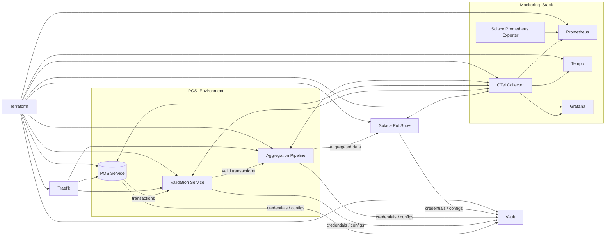
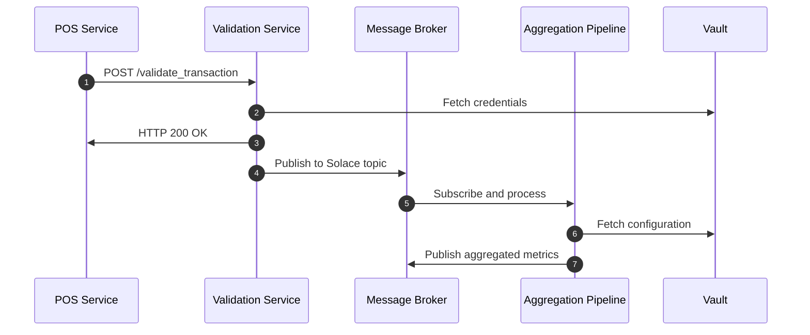
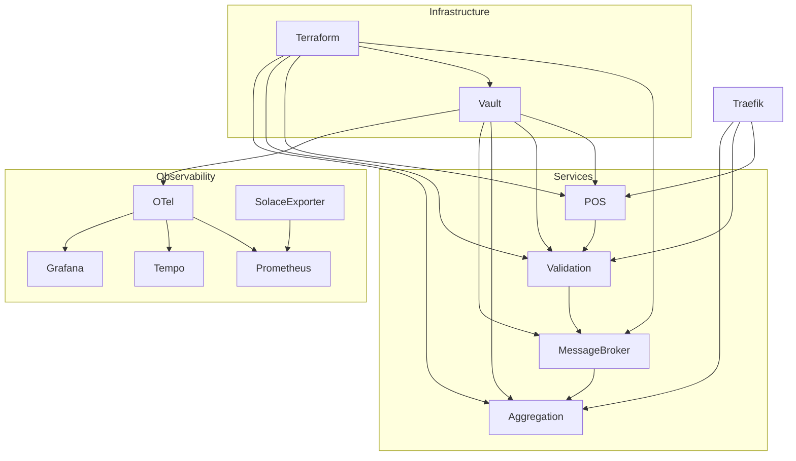

# DLMDWWDE - Data Engineering Project: POS Real-Time Integration

**University Project for Data Engineering**  
This project implements a real-time, data-intensive backend for Point-of-Sale (POS) transactions using a Microservice Architecture. The system is built to be reliable, scalable, maintainable, and secure while addressing data protection and governance. The project showcases modern data engineering principles, integrating message brokering, monitoring, secrets management, and real-time data processing.

---

## Table of Contents

- [DLMDWWDE - Data Engineering Project: POS Real-Time Integration](#dlmdwwde---data-engineering-project-pos-real-time-integration)
  - [Table of Contents](#table-of-contents)
  - [Overview](#overview)
  - [Project Goals](#project-goals)
  - [System Architecture](#system-architecture)
    - [High-Level Architecture](#high-level-architecture)
    - [Sequence Diagram](#sequence-diagram)
    - [Dependency Diagram](#dependency-diagram)
  - [Vault Structure](#vault-structure)
  - [Key Features](#key-features)
  - [Setup Instructions](#setup-instructions)
    - [Prerequisites](#prerequisites)
    - [Steps to Run](#steps-to-run)
  - [Monitoring and Observability](#monitoring-and-observability)
  - [Data Security and Governance](#data-security-and-governance)
  - [Challenges and Lessons Learned](#challenges-and-lessons-learned)
    - [Challenges](#challenges)
    - [Lessons Learned](#lessons-learned)
  - [Future Enhancements](#future-enhancements)
  - [Contact](#contact)

---

## Overview

This project demonstrates a real-time integration platform for POS data, designed to simulate a production-grade data engineering workflow. It supports:

- Real-time POS transaction streaming
- Transaction validation
- Data aggregation for analytics
- Monitoring, tracing, and logging
- Secure secrets management via Vault

The infrastructure is fully containerized with **Docker Compose**, enabling rapid local deployment and reproducibility.

---

## Project Goals

- **Reliability**: Ensure fault-tolerant communication between services.
- **Scalability**: Design the system to handle increasing transaction volumes.
- **Maintainability**: Use modular and reusable Microservice Architecture.
- **Data Security**: Safeguard sensitive information using Vault.
- **Data Governance**: Ensure compliance with data handling and storage regulations.
- **Observability**: Provide detailed insights into system health and performance.

---

## System Architecture

### High-Level Architecture



---

### Sequence Diagram



---

### Dependency Diagram



---

## Vault Structure

The system uses Vault to manage configurations and secrets.

```
kv/
├── vault-service/
│   ├── config/
│   │   ├── vault_addr
│   │   ├── api_addr
│   ├── creds/
│       ├── token/
│       │   ├── root_token
├── message-broker/
│   ├── config/
│   │   ├── http_host
│   │   ├── http_port
│   │   ├── http_protocol
│   │   ├── smf_host
│   │   ├── smf_port
│   │   ├── smf_protocol
│   │   ├── health_host
│   │   ├── health_port
│   │   ├── health_protocol
│   │   ├── amqp_host
│   │   ├── amqp_port
│   │   ├── msg_vpn
│   │   ├── pos_topic_prefix
│   │   ├── aggregation-service/
│   │   │   ├── queue_name
│   ├── creds/
│       ├── login/
│       │   ├── username
│       │   ├── password
│       ├── otel/
│       │   ├── username
│       │   ├── password
│       ├── validation-service/
│       │   ├── username
│       │   ├── password
│       ├── aggregation-service/
│       │   ├── username
│       │   ├── password
├── validation-service/
│   ├── config/
│       ├── api_protocol
│       ├── api_host
│       ├── api_port
│   ├── creds/
│       ├── aggregation-service/
│       │   ├── username
│       │   ├── password
│       ├── pos-service/
│       │   ├── username
│       │   ├── password
├── __aggregation-service/ -> read-only__ 
├── __pos-service/ -> read-only__
├── __otel-collector/ -> read-only__
```

---

## Key Features

1. **Message Brokering**: Solace PubSub+ facilitates communication between services.
2. **Monitoring and Observability**: 
   - OpenTelemetry for tracing
   - Prometheus and Grafana for metrics visualization
   - Tempo for distributed tracing
3. **Secrets Management**: Vault securely stores secrets and credentials.
4. **Load Balancing**: Traefik enables reliable service routing.

---

## Setup Instructions

### Prerequisites

- Docker and Docker Compose installed
- Terraform and Vault CLI (optional for debugging)

### Steps to Run

1. Clone the repository:

   ```bash
   git clone https://github.com/Tuuliyo/DLMDWWDE.git
   cd DLMDWWDE
   ```

2. Start the system:

   ```bash
   docker-compose up --build
   ```

3. Access services:
   - Solace PubSub+: [http://localhost:8088](http://localhost:8088) (admin/admin)
   - Grafana: [http://localhost:3000](http://localhost:3000) (admin/admin)
   - Prometheus: [http://localhost:9090](http://localhost:9090)

---

## Monitoring and Observability

- OpenTelemetry Collector gathers and exports traces.
- Prometheus scrapes metrics from services and Solace.
- Grafana provides dashboards for real-time analytics.
- Tempo stores distributed traces for debugging.

---

## Data Security and Governance

- Vault secures secrets using policies and role-based access control.
- All credentials are dynamically injected into services at runtime.
- AppRole ensures service-specific access to Vault secrets.

---

## Challenges and Lessons Learned

### Challenges

- Ensuring service reliability under high transaction volumes.
- Managing dynamic secret injection in Vault with multiple services.
- Debugging distributed traces across services.

### Lessons Learned

1. **Technical Skills**:
   - Advanced usage of Docker Compose and Vault.
   - Implementing observability using OpenTelemetry, Prometheus, and Grafana.
   - Writing scalable microservices using Python.

2. **Soft Skills**:
   - Effective debugging of distributed systems.
   - Time management and task prioritization.
   - Clear documentation for reproducibility.

---

## Future Enhancements

- Automate scaling and failover testing.
- Enhance security with TLS for all services.
- Add support for batch processing alongside streaming.

---

## Contact

For further information, please contact:  
**Name**: [Jonas Kinold]
**LinkedIn**: [Jonas Kinold](https://www.linkedin.com/in/jonas-kinold/)
**GitHub**: [Tuuliyo](https://github.com/Tuuliyo)]

